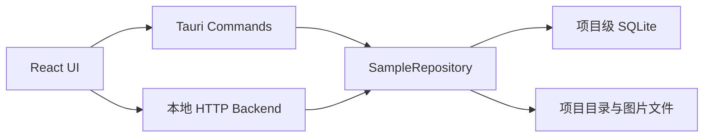
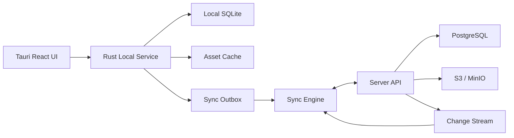
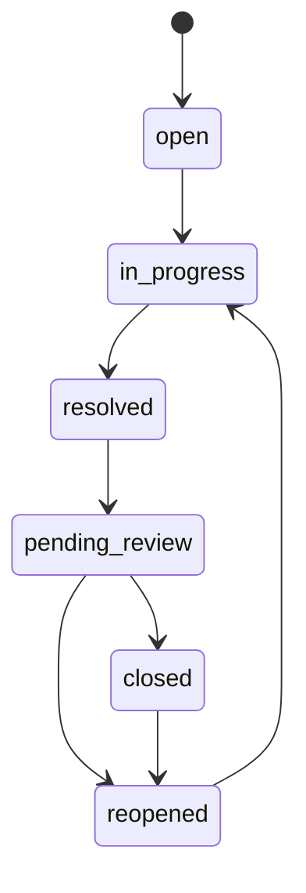
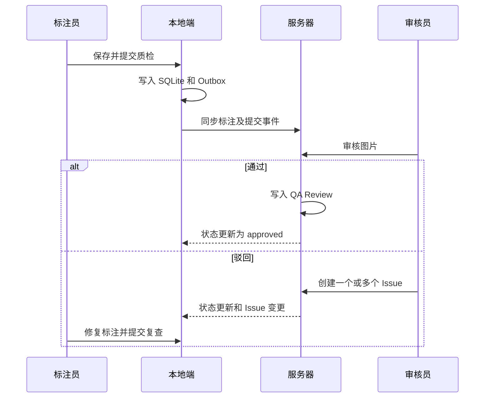

# 图像标注项目本地与服务器混合管理设计

## 1. 文档信息

| 项目 | 内容 |
| --- | --- |
| 文档状态 | 设计草案 |
| 适用产品 | Image Annotation Tauri Desktop |
| 编写日期 | 2026-07-23 |
| 目标版本 | Hybrid Project Management V1 |
| 核心原则 | 本地优先、服务器协作、离线可用、增量同步、冲突可见 |

本文档定义 Image Annotation 从当前单机项目仓库演进为“服务器端 + 本地端”混合项目管理系统的目标架构、数据模型、同步机制、缺陷管理、接口边界和实施路线。

本文档是实施设计，不表示其中所有能力已经完成。

---

## 2. 目标与非目标

### 2.1 目标

1. 保留 Tauri 桌面端的本地性能和离线标注能力。
2. 支持项目、图片、标注、任务、质检和缺陷的多人协作。
3. 服务器保存协作事实，本地 SQLite 保存可工作的离线副本。
4. 图片和大文件通过对象存储及本地缓存管理。
5. 所有本地修改可追踪、可重试、可同步、可审计。
6. 同一图片发生并发编辑时不静默覆盖数据。
7. 支持纯本地、云端关联和完整镜像三种项目模式。

### 2.2 非目标

1. V1 不实现实时多人同时编辑同一个标注对象。
2. V1 不实现自动合并任意重叠的边界框或多边形修改。
3. V1 不要求所有原图完整下载到本地。
4. V1 不以文件系统目录作为服务器端业务关系的唯一来源。
5. V1 不直接将 SQLite 文件上传并作为协作数据库。

---

## 3. 当前实现检查

### 3.1 当前运行结构

当前应用是本地单进程优先架构：



Tauri Commands 和本地 HTTP Backend 最终访问同一个本地 Repository。当前 HTTP Backend 是桌面应用内部的本地接口，不是独立部署的远程协作服务器。

### 3.2 当前项目目录

每个项目由独立目录管理，主要包括：

```text
projects/{project_id}/
  manifest.json
  assets/original/
  annotations/native/
  thumbnails/
  exports/
  project.sqlite
```

测试项目和工作区项目存在不同根目录，但通过统一的 `project_paths` 解析。

### 3.3 当前数据库能力

当前项目级 SQLite 已包含：

| 表 | 当前用途 | 混合架构可复用性 |
| --- | --- | --- |
| `projects` | 项目索引和统计 | 可扩展 |
| `images` | 图片、split、标注和质检状态 | 可扩展 |
| `classes` | 类别定义 | 可扩展 |
| `label_schema_versions` | 标签结构版本 | 可扩展 |
| `annotations` | 当前标注内容 | 可扩展 |
| `annotation_versions` | 标注历史版本 | 可复用 |
| `tasks` | 标注任务 | 可扩展 |
| `task_items` | 任务图片和锁定状态 | 可扩展 |
| `qa_reviews` | 质检结果 | 可复用 |
| `snapshots` | 数据集快照 | 可复用 |
| `exports` | 导出任务 | 可扩展 |
| `imports` | 导入记录 | 可扩展 |
| `audit_events` | 本地审计事件 | 可扩展 |

### 3.4 当前已经具备的同步基础

标注保存已经支持：

- 当前 revision。
- expected revision。
- 标注版本记录。
- 保存审计记录。
- 提交质检。
- 通过和驳回。
- 历史版本恢复。

这意味着当前标注保存逻辑可以扩展为 HTTP `If-Match` 或请求体 `baseRevision` 的服务器乐观锁。

### 3.5 当前主要缺口

| 能力 | 当前状态 | 目标 |
| --- | --- | --- |
| 远程服务器 | 本地进程内 HTTP | 独立部署服务 |
| 用户和组织 | 未实现 | 用户、组织、项目成员 |
| 权限 | 未实现 | RBAC 与项目角色 |
| 缺陷管理 | 依附 `review_note` | 独立 Issue 实体 |
| 离线同步 | 未实现 | Outbox + 增量拉取 |
| 删除同步 | 未实现 | Tombstone/`deleted_at` |
| 资源存储 | 本地路径 | 对象存储 + 本地缓存 |
| 冲突中心 | 未实现 | 可查看、处理和重试 |
| 实时通知 | 未实现 | WebSocket/SSE |
| 文件夹同步 | 部分前端本地状态 | 服务端 Folder 实体 |
| 多设备 | 未实现 | 设备游标和同步状态 |

---

## 4. 目标架构

### 4.1 总体架构



### 4.2 数据权威关系

| 数据类型 | 服务器 | 本地 |
| --- | --- | --- |
| 项目、成员、权限 | 权威 | 缓存 |
| 类别和标签结构 | 权威 | 缓存及离线读取 |
| 任务、缺陷、质检 | 权威 | 离线工作副本 |
| 正式标注版本 | 权威 | 当前副本及待同步修改 |
| 原图和附件 | 对象存储权威 | 按策略缓存 |
| 缩略图 | 对象存储/CDN | 按需缓存 |
| 本地草稿 | 同步后保存 | 首写位置 |
| UI 偏好 | 可选同步 | 权威 |
| Outbox | 不适用 | 权威 |

### 4.3 项目模式

```text
local_only
cloud_linked
mirrored
```

#### `local_only`

- 不需要登录。
- 项目、图片和标注仅保存在本地。
- 可以在后续执行“发布到服务器”。

#### `cloud_linked`

- 项目元数据来自服务器。
- 本地只缓存当前工作集、缩略图和按需原图。
- 适合大规模数据集。

#### `mirrored`

- 服务器项目在本地保持完整镜像。
- 适合长期离线或网络不稳定环境。
- 需要磁盘空间检查和完整性校验。

---

## 5. 服务划分

### 5.1 桌面端模块

建议将当前 Repository 重构为以下接口：

```rust
trait ProjectRepository {
    fn list_projects(&self) -> Result<Vec<Project>>;
    fn get_project(&self, id: &str) -> Result<Project>;
    fn save_annotation(&self, command: SaveAnnotationCommand)
        -> Result<AnnotationSaveResult>;
    fn list_issues(&self, query: IssueQuery) -> Result<Vec<Issue>>;
}
```

桌面端内部模块：

```text
LocalProjectRepository
LocalAssetCache
SyncOutboxRepository
SyncEngine
RemoteApiClient
ConflictRepository
CredentialStore
```

React UI 只调用本地 Rust 服务，不直接依赖远程 API。远程不可用时，UI 仍然可以读取本地数据库和保存离线操作。

### 5.2 服务器端模块

V1 可以采用模块化单体：

```text
Auth
Organizations
Projects
Assets
Annotations
Tasks
Quality
Issues
Snapshots
Exports
Sync
Audit
Notifications
```

推荐基础设施：

| 组件 | 推荐 |
| --- | --- |
| 业务数据库 | PostgreSQL |
| 对象存储 | S3 或 MinIO |
| 缓存与短锁 | Redis，可延后 |
| 异步任务 | 数据库队列或 Redis Queue |
| 实时事件 | WebSocket 或 SSE |
| API | REST/JSON，后续可增加批量接口 |

---

## 6. 核心数据模型

### 6.1 通用同步字段

需要同步的实体统一包含：

```text
id              UUID/ULID
project_id      UUID/ULID
revision        BIGINT
created_at      TIMESTAMPTZ
updated_at      TIMESTAMPTZ
deleted_at      TIMESTAMPTZ NULL
created_by      USER_ID
updated_by      USER_ID
```

本地副本增加：

```text
server_revision
local_revision
sync_status
last_synced_at
sync_error
dirty
```

建议同步状态：

```text
synced
pending
syncing
conflict
failed
local_only
```

### 6.2 项目

```sql
projects (
  id,
  organization_id,
  name,
  description,
  mode,
  status,
  label_schema_id,
  revision,
  created_by,
  created_at,
  updated_at,
  deleted_at
);
```

项目状态：

```text
draft
active
archived
deleted
```

### 6.3 项目成员与权限

```sql
project_members (
  project_id,
  user_id,
  role,
  joined_at
);
```

推荐角色：

| 角色 | 权限 |
| --- | --- |
| `owner` | 项目全部权限 |
| `manager` | 数据、任务、成员、导出管理 |
| `annotator` | 标注和提交质检 |
| `reviewer` | 质检、缺陷创建和关闭 |
| `viewer` | 只读 |

服务器必须执行权限校验。桌面端按钮禁用只用于体验，不可替代服务器鉴权。

### 6.4 图片与资源

```sql
assets (
  id,
  project_id,
  file_name,
  object_key,
  thumbnail_key,
  content_hash,
  mime_type,
  width,
  height,
  byte_size,
  split,
  status,
  revision,
  created_at,
  updated_at,
  deleted_at
);
```

禁止以客户端绝对路径作为服务器资源标识。客户端路径只能保存在本地缓存记录中。

### 6.5 标注

当前标注可以继续以图片为聚合根：

```sql
annotations (
  id,
  project_id,
  image_id,
  revision,
  schema_version_id,
  object_json,
  status,
  updated_by,
  updated_at,
  deleted_at
);
```

历史版本：

```sql
annotation_versions (
  id,
  annotation_id,
  revision,
  object_json,
  operation_id,
  created_by,
  created_at
);
```

V1 不强制把每个框拆成关系表。保留 JSON 聚合可降低迁移成本，但标注对象必须拥有稳定 `object_id`，供缺陷关联和后续对象级合并使用。

---

## 7. 缺陷与质检设计

### 7.1 设计原则

质检结论和缺陷必须拆分：

- 质检记录表示一次审核行为。
- 缺陷表示需要跟踪和解决的问题。
- 一次质检可以产生零个或多个缺陷。
- 缺陷可以关联整张图片，也可以关联具体标注对象。

### 7.2 缺陷表

```sql
issues (
  id,
  project_id,
  image_id,
  annotation_object_id,
  title,
  description,
  severity,
  status,
  source,
  reporter_id,
  assignee_id,
  due_at,
  revision,
  created_at,
  updated_at,
  resolved_at,
  deleted_at
);
```

### 7.3 缺陷附属数据

```sql
issue_comments (
  id,
  issue_id,
  author_id,
  content,
  created_at,
  updated_at,
  deleted_at
);

issue_attachments (
  id,
  issue_id,
  object_key,
  file_name,
  mime_type,
  byte_size,
  created_by,
  created_at
);

issue_events (
  id,
  issue_id,
  event_type,
  before_json,
  after_json,
  actor_id,
  created_at
);
```

### 7.4 缺陷状态



状态定义：

| 状态 | 含义 |
| --- | --- |
| `open` | 已创建，未处理 |
| `in_progress` | 正在修复 |
| `resolved` | 标注员声明完成 |
| `pending_review` | 等待审核确认 |
| `closed` | 审核确认关闭 |
| `reopened` | 复查失败或再次出现 |

### 7.5 严重度

```text
blocker
critical
major
minor
suggestion
```

### 7.6 质检流程



---

## 8. 本地数据库扩展

### 8.1 同步 Outbox

```sql
CREATE TABLE sync_outbox (
  id TEXT PRIMARY KEY,
  project_id TEXT NOT NULL,
  entity_type TEXT NOT NULL,
  entity_id TEXT NOT NULL,
  operation TEXT NOT NULL,
  base_revision INTEGER,
  payload_json TEXT NOT NULL,
  status TEXT NOT NULL,
  retry_count INTEGER NOT NULL DEFAULT 0,
  next_retry_at TEXT,
  error_message TEXT,
  created_at TEXT NOT NULL,
  updated_at TEXT NOT NULL
);
```

操作类型：

```text
create
update
delete
submit
transition
comment
```

### 8.2 同步游标

```sql
CREATE TABLE sync_cursors (
  project_id TEXT PRIMARY KEY,
  server_cursor TEXT NOT NULL,
  last_pulled_at TEXT,
  last_pushed_at TEXT
);
```

### 8.3 冲突记录

```sql
CREATE TABLE sync_conflicts (
  id TEXT PRIMARY KEY,
  project_id TEXT NOT NULL,
  entity_type TEXT NOT NULL,
  entity_id TEXT NOT NULL,
  base_json TEXT,
  local_json TEXT NOT NULL,
  remote_json TEXT NOT NULL,
  status TEXT NOT NULL,
  created_at TEXT NOT NULL,
  resolved_at TEXT
);
```

### 8.4 本地资源缓存

```sql
CREATE TABLE asset_cache (
  asset_id TEXT PRIMARY KEY,
  content_hash TEXT NOT NULL,
  local_path TEXT NOT NULL,
  cache_kind TEXT NOT NULL,
  byte_size INTEGER NOT NULL,
  last_accessed_at TEXT NOT NULL,
  verified_at TEXT
);
```

---

## 9. 同步协议

### 9.1 本地写入流程

所有可离线修改必须在一个本地事务中完成：

```text
1. 更新本地业务表
2. 增加 local_revision
3. 标记 sync_status=pending
4. 写入 sync_outbox
5. 提交事务
6. UI 立即显示保存成功和待同步状态
```

不得先请求服务器、成功后才保存本地，否则断网时无法工作。

### 9.2 推送

```http
POST /api/v1/sync/push
Authorization: Bearer <token>
Idempotency-Key: <operation-id>
```

请求：

```json
{
  "deviceId": "device-01",
  "projectId": "project-01",
  "operations": [
    {
      "operationId": "op-01",
      "entityType": "annotation",
      "entityId": "annotation-01",
      "operation": "update",
      "baseRevision": 17,
      "payload": {}
    }
  ]
}
```

响应必须逐项返回结果：

```json
{
  "results": [
    {
      "operationId": "op-01",
      "status": "applied",
      "serverRevision": 18
    }
  ]
}
```

可选状态：

```text
applied
duplicate
conflict
rejected
retryable
```

### 9.3 拉取

```http
GET /api/v1/projects/{projectId}/changes?cursor=12345&limit=500
```

响应：

```json
{
  "nextCursor": "12420",
  "hasMore": false,
  "changes": [
    {
      "sequence": 12346,
      "entityType": "issue",
      "entityId": "issue-01",
      "operation": "update",
      "revision": 8,
      "payload": {}
    }
  ]
}
```

客户端应用完整批次后才能更新本地 cursor。

### 9.4 幂等性

每个本地写操作生成稳定 `operation_id`。服务器保存已处理操作 ID，重复请求返回原结果，不重复创建版本、评论或审计事件。

### 9.5 重试策略

```text
第 1 次：立即
第 2 次：2 秒
第 3 次：5 秒
第 4 次：15 秒
后续：指数退避，最大 5 分钟
```

认证失败、权限不足和业务校验失败不能无限重试。

---

## 10. 冲突处理

### 10.1 标注乐观锁

标注更新携带 `baseRevision`：

```http
PUT /api/v1/projects/{projectId}/images/{imageId}/annotation
If-Match: "17"
```

服务器当前 revision 不是 17 时返回：

```http
409 Conflict
```

响应应包含：

```json
{
  "code": "ANNOTATION_REVISION_CONFLICT",
  "baseRevision": 17,
  "currentRevision": 19,
  "remoteAnnotation": {}
}
```

### 10.2 冲突策略

| 实体 | 默认策略 |
| --- | --- |
| 评论、审计事件 | 追加合并 |
| 文件夹成员关系 | 集合合并 |
| UI 偏好 | 最后写入 |
| 缺陷不同字段 | 字段级合并 |
| 缺陷状态 | 状态机校验后合并 |
| 同一图片标注 | 人工处理 |
| 删除与修改 | 人工确认 |

### 10.3 标注编辑租约

服务器可以为图片提供短租约：

```text
lease_id
image_id
user_id
device_id
expires_at
```

建议：

- 默认租约 5 分钟。
- 编辑期间每 60 秒续约。
- 断网后允许本地继续编辑，但显示“离线，可能产生冲突”。
- 租约不是数据正确性的唯一保障，最终仍依赖 revision。

### 10.4 冲突中心

桌面端需要统一冲突页面，支持：

- 查看本地版本。
- 查看服务器版本。
- 查看共同基础版本。
- 选择保留本地或服务器。
- 对标注进行人工合并。
- 重试同步。
- 导出冲突数据。

---

## 11. 图片和文件管理

### 11.1 对象存储

服务器数据库不保存图片二进制，只保存对象键和元数据：

```text
projects/{project_id}/assets/{asset_id}/original
projects/{project_id}/assets/{asset_id}/thumbnail
projects/{project_id}/issues/{issue_id}/attachments/{attachment_id}
```

### 11.2 完整性

每个资源记录：

```text
SHA-256
byte_size
mime_type
width
height
```

客户端下载完成后校验哈希。校验失败时删除缓存并重试。

### 11.3 缓存策略

```text
thumbnail_only
on_demand
full_mirror
```

缓存清理不能删除：

- 尚未上传的本地资源。
- 被 Outbox 引用的附件。
- 当前打开的图片。
- 用户显式固定的离线项目。

### 11.4 文件夹

当前本地虚拟文件夹应迁移为服务端同步实体：

```sql
folders (
  id,
  project_id,
  parent_id,
  name,
  sort_order,
  revision,
  created_at,
  updated_at,
  deleted_at
);

folder_members (
  folder_id,
  image_id,
  revision,
  created_at,
  deleted_at
);
```

文件夹是逻辑组织关系，不应直接移动对象存储中的原图。

---

## 12. API 设计

### 12.1 项目

```text
GET    /api/v1/projects
POST   /api/v1/projects
GET    /api/v1/projects/{projectId}
PATCH  /api/v1/projects/{projectId}
DELETE /api/v1/projects/{projectId}
GET    /api/v1/projects/{projectId}/members
POST   /api/v1/projects/{projectId}/members
```

### 12.2 图片与资源

```text
GET    /api/v1/projects/{projectId}/images
POST   /api/v1/projects/{projectId}/assets/upload-session
POST   /api/v1/projects/{projectId}/assets/{assetId}/complete
GET    /api/v1/assets/{assetId}/download-url
```

### 12.3 标注

```text
GET    /api/v1/projects/{projectId}/images/{imageId}/annotation
PUT    /api/v1/projects/{projectId}/images/{imageId}/annotation
GET    /api/v1/projects/{projectId}/images/{imageId}/annotation/versions
POST   /api/v1/projects/{projectId}/images/{imageId}/submit
POST   /api/v1/projects/{projectId}/images/{imageId}/lease
DELETE /api/v1/projects/{projectId}/images/{imageId}/lease
```

### 12.4 缺陷

```text
GET    /api/v1/projects/{projectId}/issues
POST   /api/v1/projects/{projectId}/issues
GET    /api/v1/issues/{issueId}
PATCH  /api/v1/issues/{issueId}
POST   /api/v1/issues/{issueId}/transition
POST   /api/v1/issues/{issueId}/comments
POST   /api/v1/issues/{issueId}/attachments
```

### 12.5 同步

```text
POST   /api/v1/sync/push
GET    /api/v1/projects/{projectId}/changes
GET    /api/v1/projects/{projectId}/sync-bootstrap
```

---

## 13. 安全设计

### 13.1 认证

- 使用 OAuth 2.1/OIDC 或服务器签发的短期 Access Token。
- Refresh Token 保存到 macOS Keychain、Windows Credential Manager 或 Linux Secret Service。
- 禁止将长期令牌保存到 `localStorage`。

### 13.2 授权

- 每个服务器写接口都校验项目成员关系和角色。
- 下载 URL 使用短期签名。
- 审计日志记录用户、设备、IP、操作和结果。
- 项目删除使用软删除和保留期。

### 13.3 本地安全

- 项目数据库默认属于当前系统用户。
- 可选提供 SQLite 加密。
- 日志不得记录令牌、完整标注载荷和签名下载 URL。
- 本地 HTTP Backend 应仅绑定 loopback，并使用随机端口或会话令牌。

---

## 14. UI 与状态反馈

### 14.1 全局连接状态

```text
已同步
同步中
离线
有待同步修改
同步失败
存在冲突
无权限
```

### 14.2 项目卡片

项目卡片需要显示：

- 项目模式。
- 最后同步时间。
- 待同步操作数。
- 冲突数。
- 本地缓存占用。
- 当前成员权限。

### 14.3 图片卡片

图片卡片需要显示：

- 标注状态。
- 质检状态。
- 未关闭缺陷数。
- 是否被其他用户租用。
- 本地是否有未同步修改。
- 是否可离线打开。

### 14.4 缺陷页面

建议包含：

- 列表、看板和图片定位三种视图。
- 状态、严重度、负责人、类别、创建时间筛选。
- 缺陷详情、评论、附件和历史记录。
- 从图片预览或标注对象直接创建缺陷。

---

## 15. 迁移方案

### 阶段 0：清理领域边界

- 将 `SampleRepository` 重命名并抽象为 Repository trait。
- 分离本地 Repository、HTTP Client 和同步引擎。
- 统一实体 ID、时间格式和错误码。
- 明确本地 HTTP Backend 仅用于桌面内部通信。

### 阶段 1：本地缺陷模型

- 新增 `issues`、`issue_comments`、`issue_events`。
- 将新的质检驳回写入 Issue。
- 兼容读取旧 `review_note`。
- 增加缺陷列表和详情 UI。

### 阶段 2：同步基础

- 为核心表增加 revision、deleted_at 和 sync_status。
- 新增 `sync_outbox`、`sync_cursors`、`sync_conflicts`。
- 所有本地写操作改为业务表与 Outbox 同事务提交。
- 增加同步状态 UI。

### 阶段 3：服务器项目与权限

- 部署 PostgreSQL 服务。
- 实现组织、用户、项目成员和 RBAC。
- 实现项目、任务、缺陷和标注 API。
- 支持将纯本地项目发布为云端项目。

### 阶段 4：对象存储

- 实现分片上传和签名下载。
- 引入 SHA-256 校验。
- 实现缩略图、按需原图和完整镜像策略。
- 增加缓存空间管理。

### 阶段 5：冲突和实时事件

- 实现服务器变更序列。
- 实现增量拉取和 WebSocket/SSE 通知。
- 实现冲突中心。
- 实现图片编辑租约。

---

## 16. 兼容和迁移细节

### 16.1 本地数据库迁移

- 使用显式 schema version。
- 每个迁移在事务中执行。
- 迁移前创建数据库备份。
- 迁移失败时保留旧数据库并停止写入。
- 不通过反复执行无版本的 `ALTER TABLE` 作为长期迁移机制。

### 16.2 旧质检数据

旧数据转换规则：

```text
qa_status=驳回 且 review_note 非空
→ 创建 source=migration 的 Issue
→ severity=major
→ status=open
→ description=review_note
```

原 `qa_reviews` 保留，不删除。

### 16.3 旧文件夹数据

当前前端本地文件夹数据迁移时：

1. 读取项目对应的本地存储键。
2. 在服务器创建 Folder。
3. 将图片 assignment 转换为 Folder Member。
4. 同步成功后保留一段兼容期。
5. 用户确认后清理旧本地状态。

---

## 17. 可观测性

服务端需要记录：

- API 成功率和延迟。
- 同步推送和拉取耗时。
- 409 冲突率。
- Outbox 重试次数。
- 图片上传下载失败率。
- 每项目待同步数量。
- WebSocket 在线设备数。

桌面端诊断页面需要提供：

- 设备 ID。
- 当前服务器地址。
- 登录用户。
- 项目同步游标。
- Outbox 数量。
- 最近同步错误。
- 缓存目录和占用。
- 导出诊断包，默认脱敏。

---

## 18. 测试策略

### 18.1 单元测试

- Issue 状态机。
- Revision 冲突判断。
- Outbox 幂等操作。
- 退避重试。
- 权限矩阵。
- 本地数据库迁移。

### 18.2 集成测试

- 离线保存后恢复网络并同步。
- 同一操作重复推送。
- 两个客户端同时修改同一图片。
- 删除与修改冲突。
- Token 过期刷新。
- 大图片断点续传。
- 增量游标中断恢复。

### 18.3 端到端测试

- 创建云端项目并下载到桌面端。
- 离线完成标注并提交。
- 审核员在另一设备创建缺陷。
- 标注员修复并提交复查。
- 审核员关闭缺陷。
- 创建快照并导出。

---

## 19. 验收标准

Hybrid Project Management V1 至少满足：

1. 网络断开时可以打开已缓存项目并保存标注。
2. 本地保存成功后一定存在对应 Outbox 操作。
3. 恢复网络后待同步操作可自动上传。
4. 重复上传不会产生重复版本或评论。
5. 同一标注 revision 冲突不会静默覆盖。
6. 用户能查看并处理同步冲突。
7. 缺陷拥有独立 ID、状态、严重度、负责人和历史。
8. 服务器强制执行项目角色权限。
9. 原图通过对象存储管理，本地缓存可清理和重新获取。
10. 项目可以选择 local_only、cloud_linked 或 mirrored。
11. 所有关键写操作存在服务器审计记录。
12. 旧本地项目无需服务器也能继续使用。

---

## 20. 关键技术决策

| 决策 | 结论 | 原因 |
| --- | --- | --- |
| UI 是否直接请求服务器 | 否 | 保证离线和统一本地状态 |
| 服务器是否同步 SQLite 文件 | 否 | 无法安全多人合并 |
| 图片是否进入 PostgreSQL | 否 | 使用对象存储更适合大文件 |
| 标注是否使用乐观锁 | 是 | 当前已有 revision 基础 |
| 是否使用最后写入覆盖标注 | 否 | 会静默丢失数据 |
| 缺陷是否继续使用 review_note | 否 | 无法形成完整生命周期 |
| 文件夹是否移动真实对象 | 否 | 文件夹应是逻辑关系 |
| 是否一开始拆微服务 | 否 | 模块化单体更适合 V1 |
| 是否支持本地纯离线项目 | 是 | 保留桌面产品核心价值 |

---

## 21. 后续实施文档

进入开发前应继续产出：

1. PostgreSQL 完整 DDL。
2. 本地 SQLite migration 清单。
3. OpenAPI 3.1 接口文档。
4. 同步状态机和错误码规范。
5. RBAC 权限矩阵。
6. 缺陷页面交互原型。
7. 对象存储上传下载协议。
8. 本地项目发布到服务器的迁移流程。
